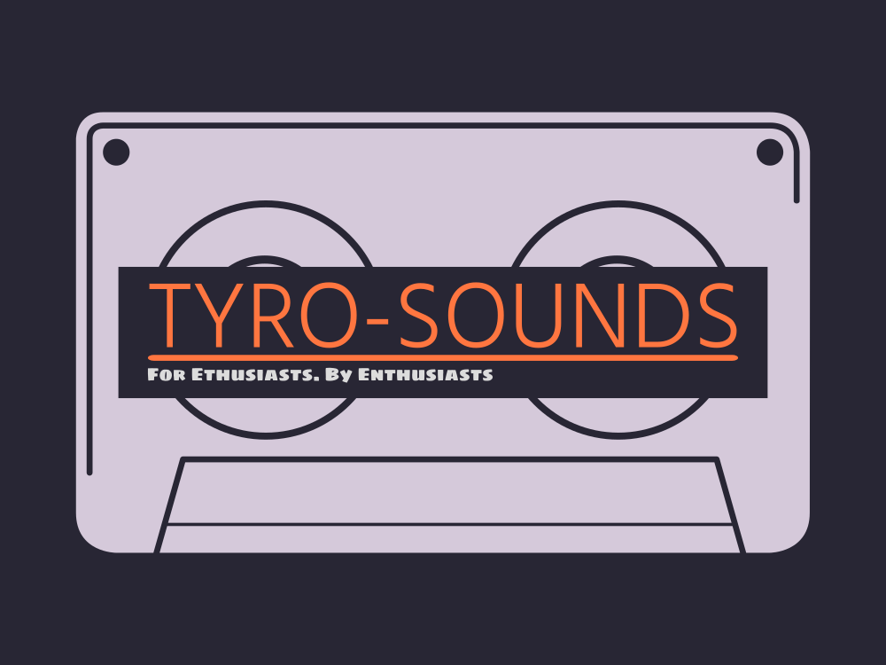

# TYRO-Sounds 

An initiative to build connections with music enthusiasts and to promote creative and unique sounds.





## Installation

Install my-project with npm

```bash
$ git clone https://github.com/asish-dewan/mern-project.git
$ cd project
$ npm install
```

### Seed Database
```bash
$ npm run seed
```

### Development mode

```bash
$ npm run develop
```

### Build app
```bash
$ npm run build
```
## Technologies used

 - MongoDB
 - Express
 - React
 - Node.js
 - Apollo Server
 - Graph QL
 - Multer 
 - Daisy UI
## Future Development

- Ability to add connections + UI to show connection list
- Introduce weekly charts to reflect popular samples
- Voting system for posts
- Donations for your favourite enthusiasts
- Sample pack creator that bundles samples of your choosing
